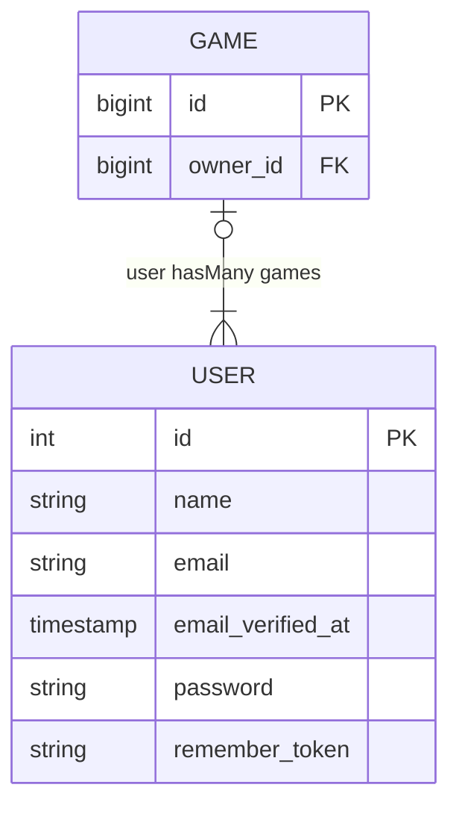

# Card Party

This is a remake of my old Covid project [Card Party](https://github.com/techenby/cardparty-og), but this time with packages that didn't exist five years ago.
I'm streaming progress on this app on [Twitch](https://www.twitch.tv/techenby/schedule).

We're currently implementing playing my family's favorite card game, Progressive Rummy. Look at the old readme for how to play the game and the various rules.

## Todo

- [x] Set up Laravel 12 application
- [x] Install Duster
- [x] Install Verbs
- [ ] Install Reverb/Echo
- [x] Create a game
- [ ] Join a game
- [ ] Begin a game
- [ ] Deal cards to players
- [ ] Play a round
    - [ ] Pickup top card or from deck
    - [ ] Reorder hand
    - [ ] Discard
    - [ ] Lay down cards
    - [ ] Move to next player
    - [ ] Buy
    - [ ] 🔥 Hot card
    - [ ] End round with when player discards last hand
    - [ ] Tally points
- [ ] Advance to next round
    - [ ] same game play but with different objective
- [ ] End game

## ERD

